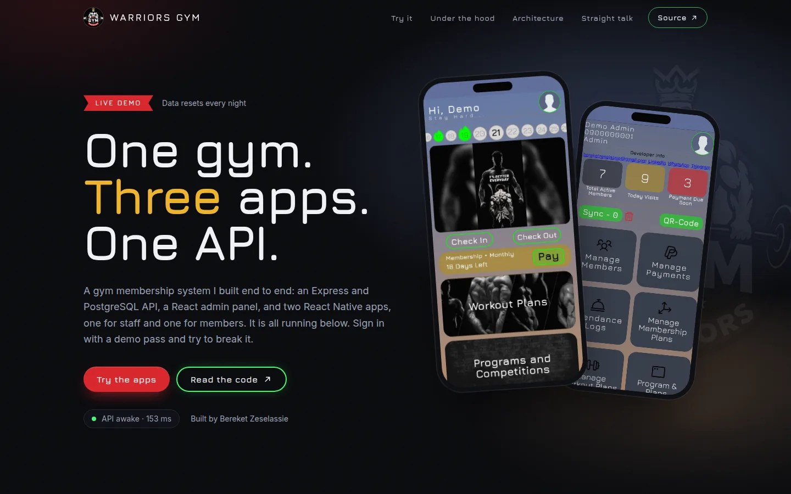
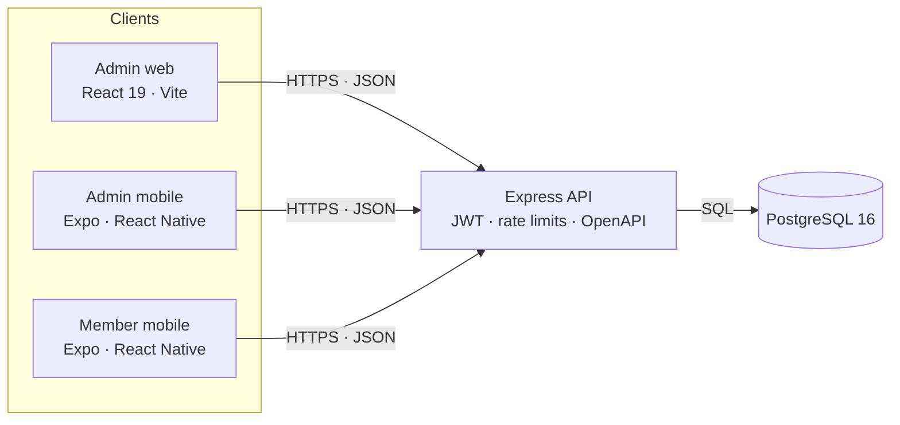
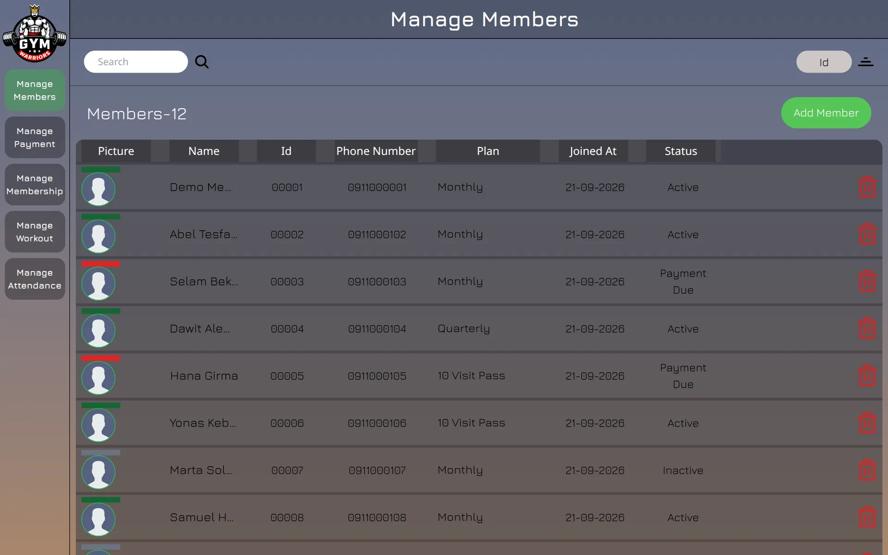
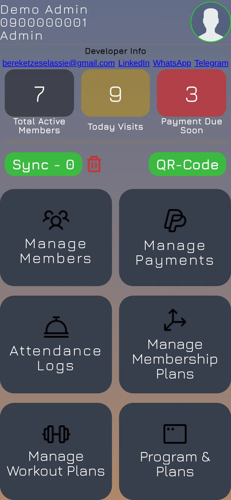
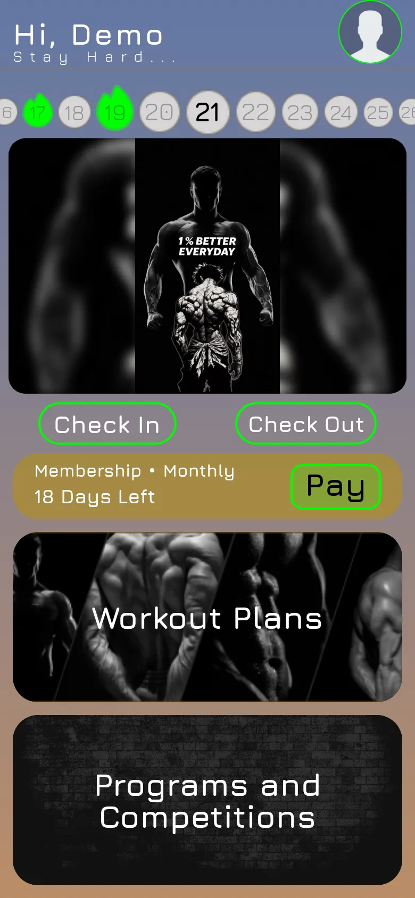

# Warriors Gym Membership System

[](https://github.com/bakiizese/Warriors-Gym-Membership/actions/workflows/ci.yml)
[](https://github.com/bakiizese/Warriors-Gym-Membership/actions/workflows/codeql.yml)
[](https://github.com/bakiizese/Warriors-Gym-Membership/actions/workflows/secrets.yml)
[](LICENSE)
[](https://warriors-gym.pages.dev)

A gym membership system I built end to end: an Express and PostgreSQL API, a React admin panel, and two React Native apps, one for staff and one for members. It started as a system for a real gym and is now a public demo you can sign in to.

**[Open the live demo](https://warriors-gym.pages.dev)**

[](https://warriors-gym.pages.dev)

## Try it

The landing page opens all three apps in the browser. Sign in with the demo logins:

| App | Phone number | Password |
| --- | --- | --- |
| Admin (web and mobile) | `0900000001` | `demo1234` |
| Member (mobile) | `0911000001` | `demo1234` |

Everyone shares these accounts, so you can change any data but not the logins themselves. To edit an account freely, register a new member in the member app and change that one instead. The data resets every night. The API runs on a free plan and sleeps when idle, so the first request can take about a minute; the status light on the landing page shows when it is awake.

## What is in it

| Part | What it does | Stack |
| --- | --- | --- |
| [`backend/`](backend) | REST API: auth and roles, members, membership plans, payments, attendance, workouts, programs. 44 endpoints, documented at `/docs` | Node 20, Express 5, Sequelize, PostgreSQL 16 |
| [`admin-frontend/web/`](admin-frontend/web) | What staff use at the desk | React 19, Vite, Tailwind |
| [`admin-frontend/mobile/`](admin-frontend/mobile) | Staff app for the gym floor: QR check-in, payments, works offline | Expo, React Native, expo-camera |
| [`mobile/`](mobile) | Member app: workout videos, membership status, payments, attendance. English, Amharic and Tigrigna | Expo, React Native, i18next |
| [`landing/`](landing) | The page above: pitch, demo logins, live previews of the apps | Vite, React 19, TypeScript, Tailwind 4 |

Both mobile apps also build for the browser, which is how the landing page shows them, and as Android APKs (see [Android APKs](#android-apks)).

## Architecture



The hosted demo runs on free plans:

| Piece | Where | Deployed by |
| --- | --- | --- |
| API | Render (Docker) | [deploy.yml](.github/workflows/deploy.yml), after CI passes on `main` |
| Database | Neon (PostgreSQL) | nothing to deploy; the API runs its own migrations on boot |
| Landing page and the three apps | Cloudflare Pages (four sites) | [deploy.yml](.github/workflows/deploy.yml) |
| Keep the API awake, reset the demo nightly | GitHub Actions on a schedule | [keepalive.yml](.github/workflows/keepalive.yml), [reset-demo.yml](.github/workflows/reset-demo.yml) |

## Screens

| Admin web | Admin mobile | Member mobile |
| --- | --- | --- |
|  |  |  |

<details>
<summary>Screenshots from the native apps</summary>

### Admin


### Member


</details>

## Engineering decisions

The short version. The reasoning is in [docs/adr](docs/adr).

- **Schema changes are migrations, not `sync()`.** Every change is a reviewed file, and the tests run all of them into a throwaway schema. ([ADR 1](docs/adr/0001-migrations-over-sync.md))
- **The API is locked down by default.** Admin sign-up needs an invite code, tokens expire, password hashes are never returned by any query unless a password is being checked, and the auth routes have their own rate limit. Details in [SECURITY.md](SECURITY.md).
- **Tests run against a real PostgreSQL.** 99 tests cover auth and role separation, plan and payment rules, check-in status changes, ownership checks and uploads. One test fails if [`openapi.yaml`](backend/docs/openapi.yaml) and the routes disagree.
- **The Android APKs are built with Gradle on GitHub Actions, not EAS.** No third-party account, and the build is in the repo. ([ADR 2](docs/adr/0002-gradle-apk-builds.md))
- **The demo is hosted for free, and built to survive that.** A keep-alive on a route that never touches the database, a deploy that waits for the new commit to answer, and a nightly reset. ([ADR 3](docs/adr/0003-free-hosting-layout.md))
- **The demo can be abused safely.** Locked demo logins, simulated payments, and a reset endpoint behind a secret token. ([ADR 4](docs/adr/0004-demo-mode.md))

### CI

One workflow runs only what a pull request touches, and a final `CI` check is the one branch protection requires. It runs ESLint on every app, the backend tests on PostgreSQL, a Trivy scan of the API image, TypeScript checks, the Expo web exports, and a smoke test that starts the whole Docker stack and calls it. CodeQL and gitleaks run on their own workflows, and Dependabot keeps npm, Docker and Actions up to date. Third-party actions are pinned to commit SHAs.

## Run it locally

### With Docker (recommended)

You need Docker with the Compose plugin. One command starts PostgreSQL, the API, the admin web app, the browser builds of both mobile apps and the landing page, with sample data and the demo logins already loaded. The first build takes a few minutes, since it compiles the two Expo apps.

```bash
git clone https://github.com/bakiizese/Warriors-Gym-Membership.git
cd Warriors-Gym-Membership
make up            # or: docker compose up --build -d
```

| What | Where |
| --- | --- |
| Landing page (start here) | http://localhost:8090 |
| Admin web app | http://localhost:8080 |
| Admin mobile app (browser build) | http://localhost:8081 |
| Member mobile app (browser build) | http://localhost:8082 |
| API docs (Swagger UI) | http://localhost:5000/docs |

The demo logins are the ones above.

| Command | What it does |
| --- | --- |
| `make dev` | Hot reload for the API (nodemon) and web admin (Vite, http://localhost:5173) |
| `make test` | Run the backend test suite in a container |
| `make reseed` | Wipe the database and reload the sample data |
| `make down` / `make clean` | Stop the stack / stop it and delete its data |

Run `make help` for all of them. Ports, the database password and the JWT secret can be overridden with a `.env` file; copy [.env.example](.env.example).

### Without Docker

- **Backend:** see [backend/README.md](backend/README.md) (Node 20+, PostgreSQL).
- **Admin web:** `cd admin-frontend/web && cp .env.example .env && npm ci && npm run dev`
- **Mobile apps** (`admin-frontend/mobile` for admins, `mobile` for members): `cp .env.example .env`, set `EXPO_PUBLIC_ADDRESS` to your machine's LAN IP (a phone cannot reach `localhost`), then `npm ci && npx expo start`.

On a device or emulator the apps run natively; the containers serve their browser builds (`npx expo export --platform web`). The API address is baked into that build, so to point it elsewhere rebuild with `EXPO_PUBLIC_ADDRESS` set.

## Hosting your own copy

The setup steps for Render, Neon and Cloudflare Pages are in [docs/deploy.md](docs/deploy.md). Nothing deploys until you set the `DEPLOY_ENABLED` repository variable.

## Android APKs

Pushing a version tag builds both apps with Gradle on GitHub Actions and attaches them to a release:

```bash
git tag v0.1.0 && git push origin v0.1.0
```

The workflow ([release-apk.yml](.github/workflows/release-apk.yml)) needs the `API_URL` repository variable set to the hosted API address, because the apps have it baked in. The APKs are 64-bit ARM only and signed with a debug key, so Android asks you to allow installing from an unknown source. The file names carry no version, so `releases/latest/download/warriors-admin.apk` and `warriors-member.apk` always point at the newest build.

## What I would do next

- **Take real payments.** The checkout is simulated. A Chapa client exists in [`backend/utils/payment.js`](backend/utils/payment.js) but is not wired in.
- **Test the front ends.** The API has 99 tests; the three apps have lint, type checks and a build, but no tests of their own. Playwright against the web builds would be the first step.
- **Move uploads off local disk** to object storage such as Cloudflare R2, so photos and videos survive a restart.
- **Add logging and error reporting.** Structured request logs and something like Sentry. Today there are console logs only.
- **Sign the Android builds** with a real key and publish them through Google Play.
- **Support more than one gym.** The data model assumes a single gym.
- **Polish the small-screen layouts** of a few admin tables.

## Documentation

| | |
| --- | --- |
| [backend/README.md](backend/README.md) | API setup, configuration, how the membership rules work |
| [docs/deploy.md](docs/deploy.md) | Hosting setup, step by step |
| [docs/adr/](docs/adr) | Architecture decision records |
| [SECURITY.md](SECURITY.md) | What is protected, and how to report a problem |

## Contributing

Create a feature branch off `main`, use [Conventional Commits](https://www.conventionalcommits.org) for messages, and open a pull request. The `CI` check has to pass before it can merge.

## Author

Built by **Bereket Zeselassie**: [GitHub](https://github.com/bakiizese) · [LinkedIn](https://www.linkedin.com/in/bereket-zeselassie-embaye) · [Telegram](https://t.me/bereket_zeselassie) · [email](mailto:bereketzeselassie@gmail.com)

## License

MIT. See [LICENSE](LICENSE).
